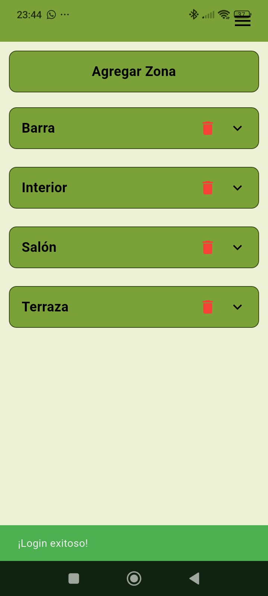
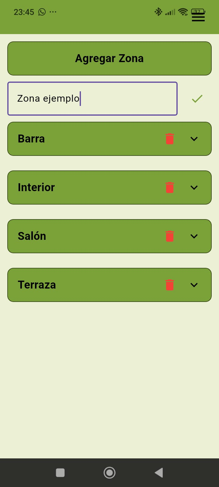
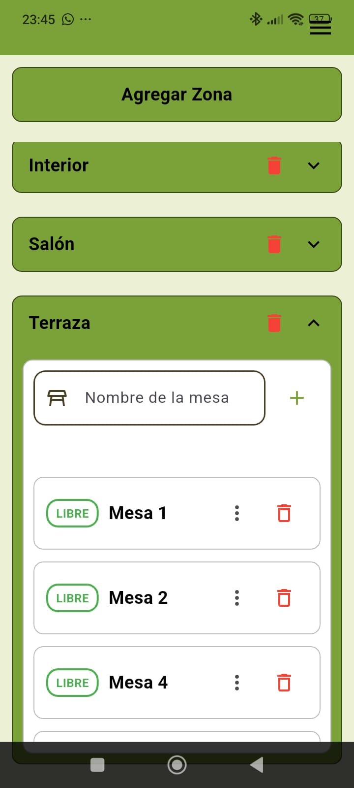
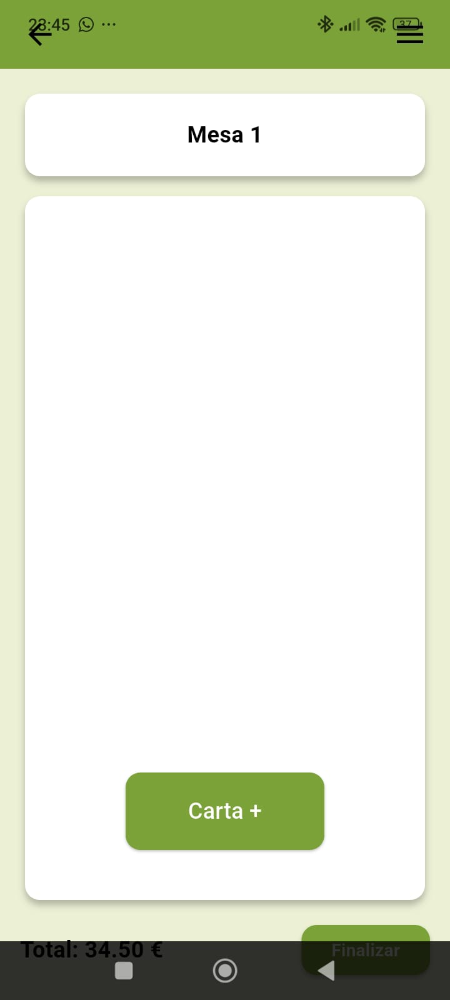
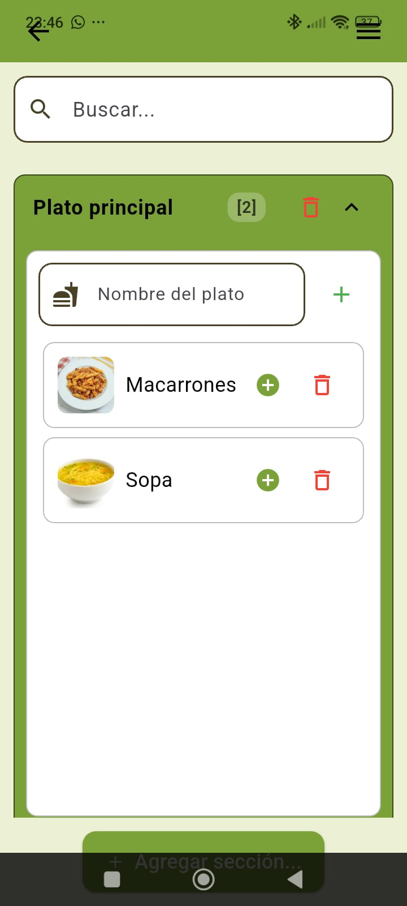
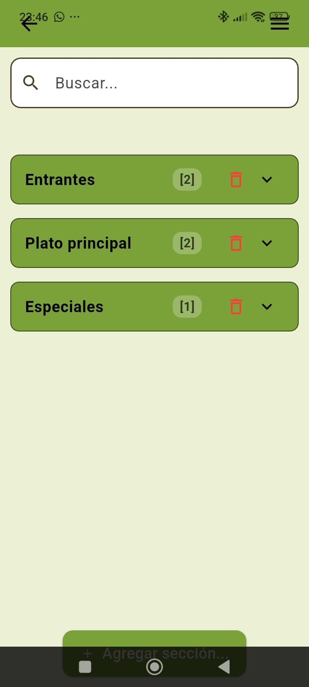
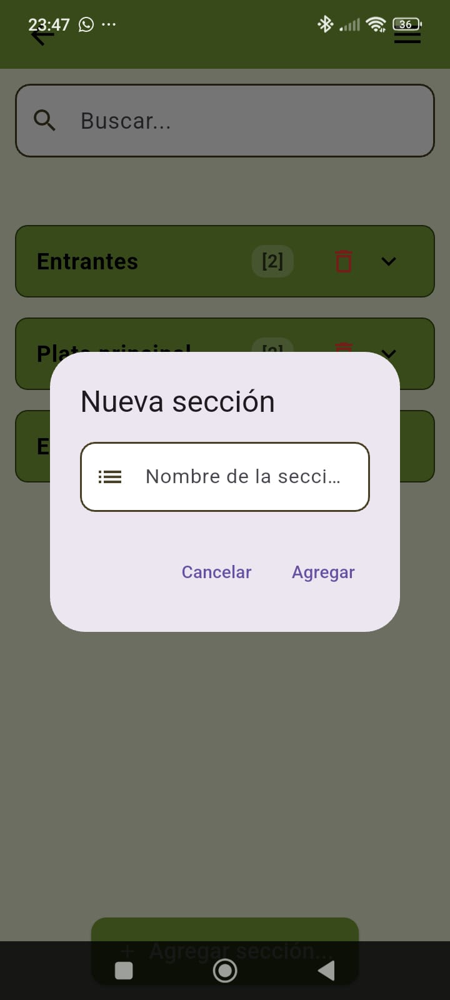
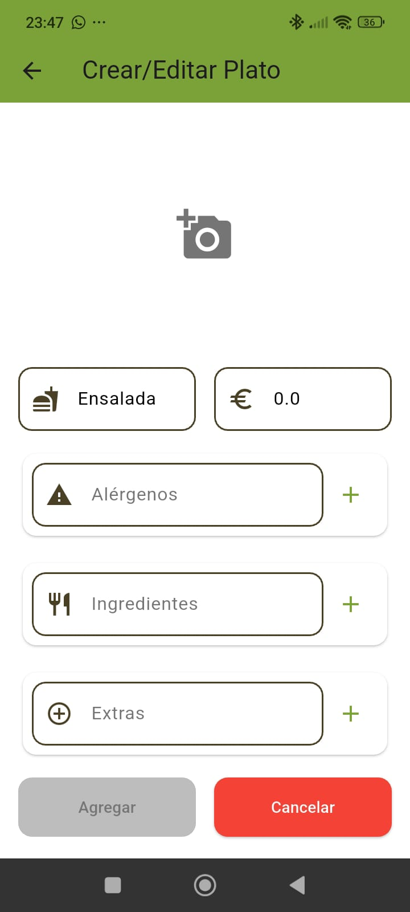
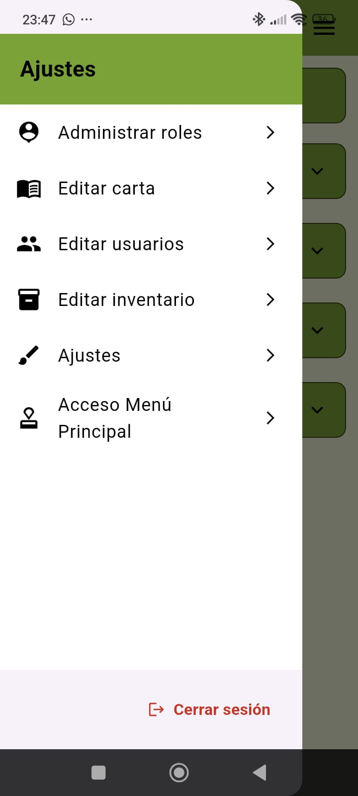
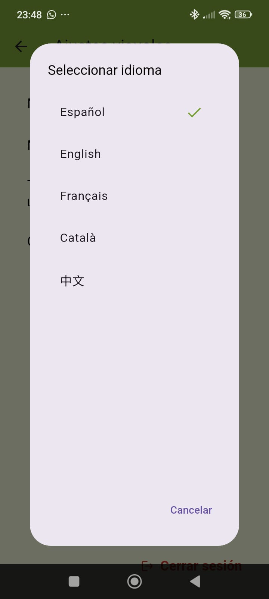

# 📖 Guía de Usuario: EZBar

¡Bienvenido a **EZBar**! Esta guía te ayudará a dominar todas las funcionalidades de tu app de gestión de hostelería, desde la configuración inicial hasta el servicio diario en mesa.

---

## 📑 Índice
1. [Primeros Pasos](#1-primeros-pasos)
2. [Gestión de Zonas](#2-gestión-de-zonas)
3. [Gestión de Mesas](#3-gestión-de-mesas)
4. [Gestión de Pedidos y Cuentas](#4-gestión-de-pedidos-y-cuentas)
5. [Configuración de la Carta](#5-configuración-de-la-carta)
6. [Personalización y Ajustes](#6-personalización-y-ajustes)

---

## 1. Primeros Pasos

### Inicio de Sesión
Para acceder a EZBar, necesitarás tu **Usuario** y **Contraseña**. Estas credenciales determinan si tienes acceso a funciones de administración o solo de servicio.

1. Abre la aplicación EZBar.
2. Introduce tu nombre de usuario.
3. Introduce tu contraseña (mínimo 8 caracteres).
4. Pulsa en **Entrar**.

> [!NOTE]
> Si no tienes conexión a internet, EZBar cargará los datos guardados localmente para que puedas seguir trabajando (modo offline).

---

## 2. Gestión de Zonas
*(Sección para Administradores)*

La aplicación organiza el local por **Zonas** (por ejemplo: Terraza, Barra, Comedor). 

> [!NOTE]
> **Permisos:** Los camareros pueden visualizar todas las zonas y sus mesas para gestionar pedidos, pero solo los administradores tienen permiso para añadir, editar o borrar zonas y mesas.

### Crear una Nueva Zona
1. En la pantalla principal, pulsa el botón **Agregar Zona**.
2. Escribe el nombre de la zona.
3. Pulsa el botón de confirmación **✓.

### Eliminar una Zona
1. Localiza la zona en la lista.
2. Pulsa el icono de la **Papelera** (rojo) junto al nombre de la zona.
3. Confirma la eliminación. *Cuidado: Esto también eliminará las mesas asociadas a esa zona.*

---

## 3. Gestión de Mesas

Cada zona contiene sus propias mesas. Puedes ver un resumen del estado de cada zona viendo cuántas mesas están libres u ocupadas.

### Estados de las Mesas
Las mesas utilizan un código de colores muy intuitivo:
*   🟢 **Libre (Verde):** La mesa está disponible para nuevos clientes.
*   🟠 **Reservado (Naranja):** La mesa está apartada para una reserva próxima.
*   🔴 **Ocupado (Rojo):** La mesa tiene una cuenta activa.

### Crear una Nueva Mesa
*(Sección para Administradores)*

1. Expande la zona donde quieres añadir la mesa pulsando sobre su nombre.
2. Localiza el campo **Nombre de la mesa** dentro de la zona.
3. Escribe el nombre o número de la mesa (ej: "Mesa 5").
4. Pulsa el botón **+** al lado del nombre para crearla.

### Cómo cambiar el estado de una mesa
1. Expande una zona pulsando sobre ella.
2. Pulsa los **tres puntos vertical (⋮)** a la derecha de la mesa.
3. Selecciona el nuevo estado.

---

## 4. Gestión de Pedidos y Cuentas
*(Sección para Camareros y Administradores)*

### Abrir o Ver la Cuenta
Pulsa directamente sobre el nombre de una mesa para acceder a su cuenta.

### Añadir Productos al Pedido
1. Dentro de la mesa, pulsa el botón **Carta +**.
2. Navega por las secciones de tu carta.
3. Pulsa el botón **+** junto a cada producto para añadirlo a la mesa.
4. Recibirás una notificación confirmando que se ha añadido.

### Gestionar Cantidades
En la pantalla de la cuenta de la mesa:
*   Pulsa **+** para añadir otra unidad del mismo producto.
*   Pulsa **-** para quitar una unidad. Si solo queda una, el icono cambiará a papelera para eliminar el producto de la cuenta.

### Finalizar y Cobrar
Cuando los clientes hayan terminado:
1. Revisa el **Total** en la parte inferior.
2. Pulsa **Finalizar**.
3. Confirma la acción. La mesa volverá a estar **Libre** y el pedido se guardará como pagado.

---

## 5. Configuración de la Carta
*(Sección para Administradores)*

Puedes acceder al editor de la carta desde el menú lateral (icono de hamburguesa ☰) -> **Editar Carta**.

### Gestionar Colecciones (Secciones)
*   **Añadir Sección:** Pulsa en "Añadir Sección" al final de la lista.
*   **Eliminar Sección:** Pulsa el icono de papelera en la cabecera de la sección.

### Gestionar Platos y Bebidas
*   **Crear Plato:** Dentro de una sección, escribe el nombre y pulsa el botón verde **+**.
*   **Editar Detalles:** Pulsa sobre un plato existente para cambiar su nombre, precio o imagen.
*   **Eliminar Plato:** Pulsa el icono de papelera al lado del plato.

---

## 6. Personalización y Ajustes

EZBar se adapta a tus necesidades visuales. Accede al menú lateral (☰) -> **Ajustes Visuales**.

*   **Modo Oscuro:** Ideal para ambientes con poca luz o ahorro de batería.
*   **Tamaño de Letra:** Elige entre Pequeño, Mediano o Grande para mejorar la legibilidad.
*   **Modo Daltónico:** Cambia los colores de la interfaz (como la barra superior) para mejorar el contraste.
*   **Idioma:** Cambia entre los idiomas disponibles (Español, Inglés, etc.).

---
*EZBar - Gestión inteligente para tu negocio.*
